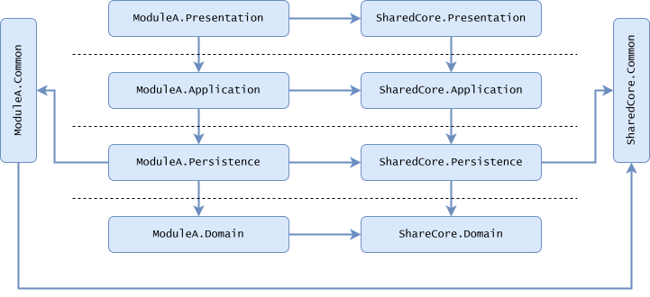
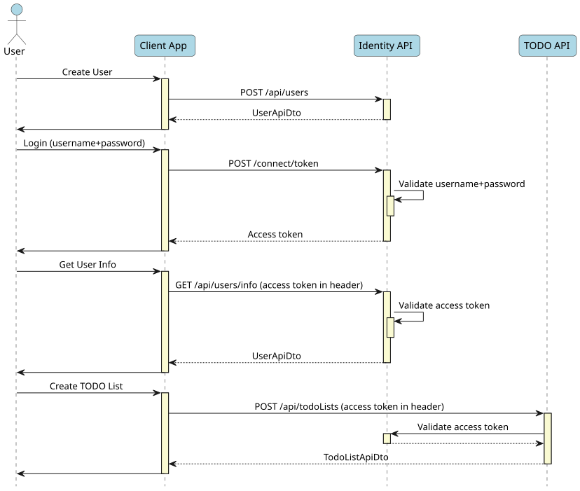

[](https://www.nuget.org/packages/PMart.Minimal.Api.Template)
[](https://www.nuget.org/packages/PMart.Minimal.Api.Template)
[](https://github.com/p-martinho/Minimal.Api.Template/actions/workflows/build-and-test.yaml)
[](https://github.com/p-martinho/Minimal.Api.Template/actions/workflows/codeql-analysis.yaml)

# Minimal API Solution

This is a .NET template to create a simple and clean ASP.NET Core API.

The idea is to create, fast and easy, a solution, with a layered architecture, and with a clean structure.

# Requirements

* [.NET 10.0 SDK](https://dotnet.microsoft.com/en-us/download/dotnet/10.0) (or later)
* [Docker Desktop](https://www.docker.com/)
* [EF Core CLI Tool](https://learn.microsoft.com/en-us/ef/core/cli/dotnet)

# Getting Started

## Installation

First, you need to install the template:

```
dotnet new install PMart.Minimal.Api.Template
```

Once installed, you can see the available options running the command:

```
dotnet new min-api --help
```

## Create a New Solution

Once installed, create a new solution using the template:

```
dotnet new min-api -n YourSolutionName
```

To add support for Docker and Docker compose, add the option `--with-docker`:

```
dotnet new min-api -n YourSolutionName --with-docker
```

By default, the created solution will not include an identity provider (check the [Authentication section](#authentication-and-authorization)), expecting you to configure an external one.
To add identity API endpoints (the API will be able to manage users and tokens), add the option `--with-identity`:

```
dotnet new min-api -n YourSolutionName --with-identity
```

## Run

Locally, you only have to run the `Aspire.AppHost` project. It requires **Docker Desktop** running, for the database.

Navigate to [https://localhost:7218/scalar]() to see the sample **Todo API** documentation page.

You can test the sample API, using the provided examples in the `.http` file: [Minimal.Api.Template.Presentation.Api.http](./src/Minimal.Api.Template.Presentation.Api/Minimal.Api.Template.Presentation.Api.http).

## Update

After having the solution working, you can implement your own project:

* Update the projects, for each layer (you can get base reference from the sample), according to your endpoints, application logic, domain and data storage.
* Set up the authentication/authorization (with the **Identity** sample, it would be updating the `SeedOpenIdTestingResourcesCommandHandler` and the settings `IdentitySettings`)
* Update packages version

# Design and Architecture

* **Architecture**:
  * Layered Architecture
* **Patterns**:
  * Command Query Responsibility Segregation ([CQRS](https://en.wikipedia.org/wiki/Command_Query_Responsibility_Segregation))
  * Domain Driven Design ([DDD](https://en.wikipedia.org/wiki/Domain-driven_design))
  * [Repository pattern](https://learn.microsoft.com/en-us/dotnet/architecture/microservices/microservice-ddd-cqrs-patterns/infrastructure-persistence-layer-implementation-entity-framework-core#using-a-custom-repository-versus-using-ef-dbcontext-directly)

The solution is structured in a **Layered Architecture**, with the layers: **Presentation**, **Application**, **Domain**, **Persistence** and **Common** (described [in the next section](#layers)).

Everything in software architecture is relative, there's no absolutely right solution, it all "depends". Therefore, don't expect I will argue that this is the greatest.
I found other great templates, for instance, using the [Clean Architecture](https://blog.cleancoder.com/uncle-bob/2012/08/13/the-clean-architecture.html). Please check them in the section [References](#references).

I found patterns that seem to me unnecessarily complex, especially for less experienced developers.
The goal of the template is to provide a solution with a clean structure, simple, but at the same time with some layer of abstraction, and following the [SOLID](https://en.wikipedia.org/wiki/SOLID) principals.

The **Layered Architecture** is straightforward, well-known, and suitable for smaller applications (better than the all-in-one architecture anyway).

The solution could be even simpler, for small playground applications or personal applications (for instance, just one project, like the MVC pattern).
I tried to get the balance. I think this solution is enterprise level and also simple enough to use in small projects, keeping the decoupling, clean code, and [SOLID](https://en.wikipedia.org/wiki/SOLID) principals.

I tried to keep the dependencies at the minimum, as discussed in the section [Technologies and Dependencies](#technologies-and-dependencies).
Therefore, it was easy to decide to not use __MediatR__ (not even taking into consideration it is commercial). Instead, the solution applies the [CQRS pattern](https://martinfowler.com/bliki/CQRS.html) using command handlers and query handlers, that are called directly and explicitly.
This way, it is easier to debug and understand what is happening instead of just sending a message and then search for the handlers of the message. And it has also performance benefits.
I totally agree that using __MediatR__ has a lot of benefits, but the intention here was only to keep things simpler and with the fewer dependencies possible.

At the **Persistence** layer, the decision was to use a [Repository pattern](https://learn.microsoft.com/en-us/dotnet/architecture/microservices/microservice-ddd-cqrs-patterns/infrastructure-persistence-layer-implementation-entity-framework-core#using-a-custom-repository-versus-using-ef-dbcontext-directly). 
Repository is controversial, and is so much easier (and not wrong at all) to use the EF Core `DbContext` directly. But, if we keep Repository simple, I don't think it is a bad idea:
* It helps on testing the application layer (the business logic doesn't need to worry about the queries, the repository can be mocked);
* It isolates the responsibility for the queries and other persistence operations in the repositories (that then can be tested independently, with a real database);
* Keep the flexibility: it is open to extension (the `DbContext` is available for the repository implementations).

In conclusion, the solution tries to be not that complex, but with a level of complexity that .NET developers are used to (we can find very simple templates, very fast to get a small project working, but that was not the intention).

## Layers

The solution is divided in 5 layers: **Presentation**, **Application**, **Domain**, **Persistence** and **Common**. Each layer is implemented in one project, inside the source folder (check the [solution structure](#logical-solution-structure)).
And each layer has its own test project. The layers are briefly explained next.

### Presentation

This is the layer related to the interaction with the "outside world". It is where the API endpoints are configured and exposed. It may include a Web application, as well (for instance, a Razor pages project).
It includes: endpoints and DTOs, the configuration of the authentication and authorization, OpenApi documents, OpenTelemetry configuration, health checks, middleware, API versioning, logging configuration, etc.
It does not include: any kind of business logic or rules, any kind of validation (except the contracts enforced by the API DTOs). It should not depend on anything from **Domain** or **Persistence**.
This layer does not know anything of how to handle the requests, it just maps the requests to commands or queries and sends them to the **Application** layer and then maps the result to a response.

### Application

This layer just exposes interfaces of command handlers and query handlers, following the [CQRS](https://en.wikipedia.org/wiki/Command_Query_Responsibility_Segregation) pattern.
All the business logic is implemented here. This layer works with **Domain** entities, operate on them, and persist the results, using the repository interfaces exposed by the **Persistence** layer.
It is not aware of how and where the entities are persisted, that is the responsibility of the **Persistence** layer.

### Domain

This layer has very few dependencies. It just has the entities and value objects. It does not include any logic regarding the way or where the entities are persisted.
The entities should follow some of the [DDD](https://en.wikipedia.org/wiki/Domain-driven_design) principals (private constructors, properties with private setters, methods to change their state internally, etc.).
The entities define the aggregate composition.

### Persistence

This layer is responsible for persisting/storing the data (in a database, for instance). It only exposes repository interfaces.
No other layer has the knowledge of how persistence happens: what tool is used (EFCore or other), what type of storage (database or other),
what type of database, etc.
The repositories include the permissions to data access and the logic to include in the queries the root aggregate with all its related entities.

**Note**: These repositories are not ORM agnostic, they were made to work with [EF Core](https://learn.microsoft.com/en-us/dotnet/architecture/microservices/microservice-ddd-cqrs-patterns/infrastructure-persistence-layer-implementation-entity-framework-core).

### Common

This is a special layer, with features that can be useful for any of the other layers, like helpers, extensions, common infrastructure classes, constants, etc.

## Project References

This is a representation of the references between the projects, with the division between the layers:



## Solution Structure

### Logical Solution Structure


### Folders Structure


## Architecture Testing

The solution includes a special test project: the `Architecture.Tests`. This project aims to validate if the architecture rules are followed.
For instance, the tests will fail if some class in the **Presentation** layer references a class from the **Domain** layer
or if the **Application** layer has any public type that is not an interface for command handler, interface for query handler or a DTO class (everything else should be internal).

It uses the library [NetArchTest.eNhancedEdition](https://github.com/NeVeSpl/NetArchTest.eNhancedEdition) to help on that. You can explore the unit tests to be more aware of the rules tested.

# Technologies and Dependencies

In this template, it was decided to use the fewer external libraries as possible to give a more "vanilla" solution and let the developer choose their favorite tools.
But there are some dependencies that were decided to use because they are popular and were considered essential.

* [ASP.NET Core](https://docs.microsoft.com/en-us/aspnet/core/introduction-to-aspnet-core)
* [Entity Framework Core](https://docs.microsoft.com/en-us/ef/core/)
* [Aspire](https://learn.microsoft.com/en-us/dotnet/aspire/get-started/aspire-overview)
  * The solution includes **Aspire**, to orchestrate the several services (API, database, etc.). It is so easy running and connecting everything for local development environments.
    It includes the [Aspire Dashboard](https://aspire.dev/dashboard/overview/), which helps a lot to visualize traces, structured logs, and metrics.
* [OpenTelemetry](https://opentelemetry.io/docs/languages/dotnet/)
  * This open source telemetry framework is enabled by the **Aspire** defaults.
* [Docker and Docker compose support](https://docs.docker.com/)
  * For the ones that prefer **Docker**, the template has the option to include the Docker and Docker compose files, necessary to get everything running in Docker containers.
* [ASP.NET Core Identity](https://learn.microsoft.com/en-us/aspnet/core/security/authentication/identity?tabs=visual-studio)
  * If the option `--with-identity` was used, the API will include sample endpoints to create, store, and authenticate users.
* [OpenIddict](https://documentation.openiddict.com/)
  * The solution contains the authentication and authorization configured out-of-the-box, as explained in the [auth section](#authentication-and-authorization).
    The decision was to use known standards (OAuth 2.0 and OpenId Connect), using an open source library.
* [Serilog](https://serilog.net/)
  * The default logging of ASP.NET Core is not perfect yet. **Serilog** is very popular and useful (structured logs, integration with different targets/sinks, etc.).
* [OpenApi](https://learn.microsoft.com/en-us/aspnet/core/fundamentals/openapi/aspnetcore-openapi)
  * The API documentation is built using the `Microsoft.AspNetCore.OpenApi` library, included as well in the ASP.NET Core templates.
* [Scalar](https://guides.scalar.com/scalar/scalar-api-references/net-integration)
  * The new ASP.NET Core templates do not include **Swagger** anymore. In this case, all the documentation is built using **OpenApi** and then the documents can be used by any interface.
  **Scalar** is one of them, selected here because Swagger UI seems outdated and the "Try out" feature is not very friendly. But is straightforward to switch to Swagger, using the same **OpenApi** documents.
* [FluentValidation](https://fluentvalidation.net/)
  * This library is very used and known, but is not absolutely necessary here. The idea is to have a validation in the **Application** layer,
  and the flow of a command or query handling should include that validation. After starting by adding some manual validation for the simple sample, I gave up and added this library for that, it is so much easier to maintain and test.
* [XUnit V3 (with MTP v2)](https://xunit.net/)
  * XUnit is on version 3, with a lot of improvements, and supporting the modern and lightweight alternative to VSTest for running tests: the Microsoft Testing Platform (MTP), in version 2.
* [NSubstitute](https://nsubstitute.github.io/)
  * For mocking in unit tests, the [Moq](https://github.com/devlooped/moq) library is more popular, but [NSubstitute](https://nsubstitute.github.io/), in my opinion, is less verbose, easy to use (and learn) and is well-known as well.
* [TestContainers](https://dotnet.testcontainers.org/)
  * For integration tests, it is fundamental to use a real database. This library makes it straightforward, using **Docker**.
* [NetArchTest.eNhancedEdition](https://github.com/NeVeSpl/NetArchTest.eNhancedEdition)
  * The solution includes [Architecture testing](#architecture-testing). This library helps on building the unit tests to enforce architectural rules, using a fluent API.

# Features

After creating the solution for the first time, explore the sample included, a simple TODO lists API, enough to make understand how the solution works. Just checking the code, it should be easy to follow the pattern.

## Layers and CQRS: the Flow

The solution applies the [CQRS pattern](https://en.wikipedia.org/wiki/Command_Query_Responsibility_Segregation), using command handlers of type `ICommandHandler<>` and query handlers of type `IQueryHandler<>`.
Each handler is responsible for just one operation (for instance, one handler to create the resource, other to update, etc.).

The handlers use generics to define the type of the input and the type of the data included in the output: `ICommandHandler<TIn, TOut>` and `IQueryHandler<TIn, TOut>`.
The input is optional for the cases where the command or the query does not need input parameters (using `ICommandHandler<TOut>` and `IQueryHandler<TOut>` instead).

### The Command Flow


### The Query Flow


## Minimal APIs

The API endpoints use the minimal APIs approach. But to keep the endpoints defined in separated classes (like we are used to with Controllers),
the solution uses a custom way to register them by endpoint group. There are plenty of ways to do the same, and very nice libraries, like [FastEndpoints](https://github.com/FastEndpoints/FastEndpoints).
But again, the idea was to keep the external dependencies at the minimum (without having to invent the wheel, of course).

Check the **Todo API** sample, to see how the endpoints are registered, by implementing the `IEndpointGroup`
(it will be registered automatically by `EndpointExtensions.MapEndpoints<TProgram>()`).

The Presentation layer uses its owns DTOs (the `ApiDtos`), instead of returning the applicational DTOs. Although it introduces more code and complexity (and more mapping),
the idea is making the API contracts stable (I would recommend having different API DTOs for each API version as well).
This way, we make sure that any change in the applicational DTO will not cause a breaking change in the API.

The `ResultType` from the `CommandOut<>` or `QueryOut<>` sets the API response code. On success, the endpoint produces a `Status200OK` or `Status201Created` response (depends on the type of operation of the endpoint).
On a non-success result, a `ProblemDetails` response is produced (check the [Error Handling](#error-handling) section), and the response code and details are mapped from the `OutputResult` (using the `OutputResultMappingExtensions.ToProblemDetails()`).

## API Versioning

The solution supports API versioning by defining the existent versions (including the deprecated ones) and assigning the endpoint groups to a version.
For each API version, it will be created one **OpenApi** document.

Check the way the version is assigned in the `TodoListsEndpointGroup` in the **Todo API**.
For setting specific versions as deprecated, provide them in `app.MapEndpoints<Program>()` call, in `Program.cs`.

## Error Handling

The way the command and query handlers are built, they always return a `CommandOut<>` or `QueryOut<>` and never throw exceptions (they use the **Result pattern**).
The exceptions should happen only on exceptional errors.

In case of an exception, the handlers should catch the exception, log it, and then return an output with the result type `ResultType.InternalError`.
Then, the APIs map it to a `Status500InternalServerError` response, without exposing details about the internal exception.

In case of error (validation error, internal error, resource not found, etc.), the APIs return a [problem details response](https://datatracker.ietf.org/doc/html/rfc9457) (`ProblemHttpResult`).
In case of an internal error output from the handlers (not an unhandled exception), and if the `InternalErrorMiddleware` is enabled, the request body will be logged, to help the debug of the issue.

In case of an unhandled exception (something terrible is happening), the exception handler (`CustomExceptionHandler`) will catch the exception, log it, and return a problem details response.

In case of a binding error (for instance, a request with the wrong format), a `BadHttpRequestException` is thrown by the framework (currently, even if the new model validation for minimal APIs is enabled).
The `CustomExceptionHandler` will return a problem details response, with a `400` status code, in this case.

## Authentication and Authorization

Some endpoints may require authorization.

In this template, if the option `--with-identity` was selected the authentication is done via **Identity** endpoints, where you can create and update users.
This API uses services from the [ASP.NET Core Identity](https://learn.microsoft.com/en-us/aspnet/core/security/authentication/identity?tabs=visual-studio), based in the [Identity API endpoints builder](https://github.com/dotnet/aspnetcore/blob/main/src/Identity/Core/src/IdentityApiEndpointRouteBuilderExtensions.cs).
The ASP.NET Core Identity uses the EF Core as the store; therefore, the Identity database will include several tables related with Identity.

The **Identity** option is just a simple way (but not the most secure way) to store users on your side, for simple applications,
but the recommended approach would be using an [external solution](https://learn.microsoft.com/en-us/aspnet/core/security/identity-management-solutions).

For authorization, the modules are configured to use an authentication scheme based on OAuth 2.0 and OpenId Connect standards, through the library [OpenIddict](https://documentation.openiddict.com/).
Therefore, for the endpoints requiring authorization, a Bearer token header is required. The token must be issued by the configured issuer.

In the template, with the **Identity** option, you are able to create tokens for existent users using the endpoint `/connect/token` (check the example in [Identity.Presentation.Api.http](./src/Minimal.Api.Template.Presentation.Api/Identity.Presentation.Api.http)).
Anyway, you can use any other external issuer (compatible with OAuth 2.0 and OpenId Connect standards), you just need to configure it properly.

The OAuth 2.0 flow implemented in this **Identity** option is the [Resource Owner Password Flow](https://auth0.com/docs/get-started/authentication-and-authorization-flow/resource-owner-password-flow), which is not recommended for security reasons.
A solution would be having an Identity Server (instead of the API), with UI to create and login users, and use it with the [Authorization Code Flow](https://auth0.com/docs/get-started/authentication-and-authorization-flow/authorization-code-flow-with-pkce).
But it is much more complex, and therefore is preferable (and more secure) to use an [external solution](https://learn.microsoft.com/en-us/aspnet/core/security/identity-management-solutions), than implementing it.

The context of the user may be needed to check permissions or access to resources, in the **Application** or **Persistence** layers.
The interface `ICurrentUser` is useful to get the details about the logged user, like claims, roles, and identifier (more details can be added).
Because this interface belongs to the **Common** layer, it can be used in any layer.

This is the authentication and authorization flow in the samples included in the template:



## Persistence

The template uses the [Entity Framework Core](https://docs.microsoft.com/en-us/ef/core/) for data persistence.

When you run the application, the database will be automatically created (if not yet) and the migrations will be applied.
In a non-development environment, the migrations are not automatic, and you should apply them using [bundles](https://learn.microsoft.com/en-us/ef/core/managing-schemas/migrations/applying?tabs=dotnet-core-cli#bundles), for instance.

The `Persistence` project adds the **SQL Server** provider. To have a different database type, change the EF Core configuration in `EfCoreDependencyInjectionExtensions`.
 
The template supports soft delete. For that, the entity should implement `ISoftDeletableEntity`.
Auditable properties can also be automatically added and updated, being the entity derived from `BaseAuditableEntity`.
These two features work using [EF Core interceptors](https://learn.microsoft.com/en-us/ef/core/logging-events-diagnostics/interceptors).

Regarding the repositories, they include methods to filter and sort the results, but they are very restricted to simple use cases.
There are packages like [Sieve](https://github.com/Biarity/Sieve) to use with more comprehensive use cases.

### Migrations

If you change the EF Core model (e.g., add a new property to an entity, or add a new entity), and you try to run the application, you will get an error: you have pending changes.
You need to create a new migration.

To create a migration, you need to have installed the [EF Core CLI Tool](https://learn.microsoft.com/en-us/ef/core/cli/dotnet). Then, in the root of the solution, run the following command:

```
dotnet ef migrations add <MigrationName> --startup-project .\src\YourSolutionName.Presentation.Api\ --project .\src\YourSolutionName.Persistence\ --context ApplicationDbContext -- --environment Migration
```

For the **Identity** context (only applicable to solutions with identity option), run this:

```
dotnet ef migrations add <MigrationName> --startup-project .\src\YourSolutionName.Presentation.Api\ --project .\src\YourSolutionName.Persistence\ --context IdentityDbContext --output-dir Migrations/Identity -- --environment Migration
```

> **Note:** The `--environment Migration` parameter is used to the pending migrations not being applied, which is the default in the `Development` environment.

If you ever need to add migrations to the `Todo.Persistence.IntegrationTests`, this would be the command:

```
dotnet ef migrations add <MigrationName> --startup-project .\tests\YourSolutionName.Persistence.IntegrationTests\ --project .\tests\YourSolutionName.Persistence.IntegrationTests\
```

## Logging and Telemetry

The template includes the [Serilog](https://serilog.net/) as a logger provider. It writes asynchronously to Console (minimum level `Information` on development, `Warning` on non-development) and to File (check the settings in `appsettings.json`).

It uses [OpenTelemetry](https://opentelemetry.io/docs/languages/dotnet/) and, if the endpoint is set in the configuration (`OTEL_EXPORTER_OTLP_ENDPOINT`), exports to an OTLP exporter. Using [Aspire](#aspire), you can visualize this data in the local environment.

The `docker-compose.override.yml` file (if added) includes the **Aspire Dashboard** to visualize the same data, when using Docker instead of running the **Aspire** project.

## Aspire

The solution has support for [Aspire](https://learn.microsoft.com/en-us/dotnet/aspire/get-started/aspire-overview). Locally, you only have to run the `Aspire.AppHost` project.
It will automatically instantiate a Docker container for the SQL Server (requires **Docker Desktop** running), add the database, waits for the database is up, and then run the API.
The **Aspire Dashboard** is launched.

In the **Aspire Dashboard** you can visualize the structured logs (with nice search and filter functionalities), traces (e.g., the calls between resources) and metrics, for each resource.

> **Note:** Aspire Dashboard does not persist data, and it is not the solution for telemetry and monitoring for production apps (you can use **Prometheus+Grafana**, or **Azure Application Insights**, for instance).

## Docker Support

If Docker files are added (with the option `--with-docker` when creating the solution),
the solution will include a `docker-compose.yml` and `docker-compose.override.yml`, and the API will include `Dockerfile` file.

The `docker-compose.override.yml` will run the following services: the API, The SQL Server, and the Aspire Dashboard.

To access the Aspire Dashboard from Docker, check the logs of the container, there will be the link to the Dashboard with the login token.

## HTTPS

The API enforces HTTPS, using the HTTPS redirection middleware (`UseHttpsRedirection()`).

For HTTPS in local development, you need to trust the .NET development certificate (just once):

```
dotnet dev-certs https --trust
```

Anyway, enforced HTTPS is problematic when running locally with Docker. The certificate must be available in the Docker container.
For that (**note: only required to run the API in Docker**), create a certificate with the same name as the project and set its password in the user secrets:

```
dotnet dev-certs https -ep %appdata%\ASP.NET\Https\YourSolutionName.Presentation.Api.pfx -p <PASSWORD>
dotnet dev-certs https --trust
dotnet user-secrets -p ./src/YourSolutionName.Presentation.Api/YourSolutionName.Presentation.Api.csproj set "Kestrel:Certificates:Development:Password" "<PASSWORD>"
```

The `docker-compose.override.yml` has the required volume mappings to share the certificate and user secrets with the container.

## Health Checks

The application has default health checks in the endpoints `/health` and `/alive`. For instance, it includes the health check for the EF Core DB context.
The endpoint `/health/full` provides full details (it uses the response writer provided by `AspNetCore.HealthChecks.UI.Client`), but it requires authentication with the role `Admin`.

There are several health checks available. Depending on your needs, install the NuGet package(s) and add the health checks in the specific layer (the DI extensions have specific methods for that).
You can, also, build your own [custom health check](https://learn.microsoft.com/en-us/aspnet/core/host-and-deploy/health-checks#create-health-checks).

## Testing

The template has a test project for each layer. Some of them are integration tests (for instance, for **Persistence** and **Presentation**), others are unit tests.

The tests use the [XUnit V3](https://xunit.net/) (with the Microsoft Testing Platform V2 enabled) as the testing framework and [NSubstitute](https://nsubstitute.github.io/) as the mocking library.

The integration tests use a real database, using the [TestContainers](https://dotnet.testcontainers.org/) library (requires **Docker Desktop** running). 
These tests take longer because they need to start the Docker containers.

✅ The template has **100%** code coverage.

To assess the code coverage, and if your IDE does not include a tool for it, follow these instructions:

1. Install (if not already) the **ReportGenerator** tool:

    ``` bash
    dotnet tool install dotnet-reportgenerator-globaltool --global
    ```

2. Run the tests with code coverage enabled. Run this command in the **root folder** of the solution:

    ``` bash
    dotnet test --solution YourSolutionName.slnx --coverage --coverage-output-format cobertura --coverage-output coverage.cobertura.xml --coverage-settings ./tests/CodeCoverage-settings.xml
    ```

3. Use the **ReportGenerator** tool to create HTML from the XML coverage files. Run this command in the **root folder** of the solution:

    ``` bash
    ReportGenerator -reports:**/coverage.cobertura.xml -targetdir:CoverageReport
    ```

4. Open the HTML file `CoverageReport\index.html` to see the results.

## Mapping

The way the application is built, we need mappings between DTOs and entities and between DTOs and API DTOs.

The mapping is done via **extensions**. There are several mapping libraries (like [Mapperly](https://github.com/riok/mapperly), for instance),
but their usage sometimes brings more problems than advantages, and also, once more, the idea is to keep the external dependencies to a minimum.

## Code Style

The template includes a `.editorconfig` file, to help maintain consistent coding styles. Currently, the content is the default created by Visual Studio. Feel free to edit it after creating the solution.

# References

* [Microsoft: REST API Guidelines](https://github.com/Microsoft/api-guidelines/blob/master/Guidelines.md)
* [Microsoft: Implement the infrastructure persistence layer with Entity Framework Core](https://learn.microsoft.com/en-us/dotnet/architecture/microservices/microservice-ddd-cqrs-patterns/infrastructure-persistence-layer-implementation-entity-framework-core)
* [Ardalis: Clean Architecture](https://github.com/ardalis/CleanArchitecture)
* [Jason Taylor: Clean Architecture](https://github.com/jasontaylordev/CleanArchitecture)
* [Mark Richards: Developer to Architect](https://www.developertoarchitect.com/)
* [Architecting Modern Web Applications with ASP.NET Core and Microsoft Azure](https://aka.ms/webappebook) (eBook)
* [Andrew Lock: Working with the result pattern](https://andrewlock.net/series/working-with-the-result-pattern/)
* [Milan Jovanović: Problem Details for ASP.NET Core APIs](https://www.milanjovanovic.tech/blog/problem-details-for-aspnetcore-apis)
* [Microsoft: Health checks in ASP.NET Core](https://learn.microsoft.com/en-us/aspnet/core/host-and-deploy/health-checks)
* [Microsoft: Health checks in Aspire](https://aspire.dev/fundamentals/health-checks/)
* [Microsoft: Minimal APIs](https://learn.microsoft.com/en-us/aspnet/core/fundamentals/minimal-apis)
* [Microsoft: Authentication and authorization in minimal APIs](https://learn.microsoft.com/en-us/aspnet/core/fundamentals/minimal-apis/security)
* [Microsoft: ASP.NET Core Identity](https://learn.microsoft.com/en-us/aspnet/core/security/authentication/identity?tabs=visual-studio)
* [Microsoft: Choose an identity management solution](https://learn.microsoft.com/en-us/aspnet/core/security/how-to-choose-identity-solution)
* [Lê Gimenes: Authorization Server with OpenIddict: The Serie](https://legimenes.medium.com/authorization-server-with-openiddict-the-serie-e2721d0451af)
* [Microsoft: Middleware in Minimal API apps](https://learn.microsoft.com/en-us/aspnet/core/fundamentals/minimal-apis/middleware)
* [Microsoft: OpenAPI support](https://learn.microsoft.com/en-us/aspnet/core/fundamentals/openapi/overview)
* [Microsoft: Integration Tests](https://learn.microsoft.com/en-us/aspnet/core/test/integration-tests)
* [Milan Jovanović: Enforcing Software Architecture With Architecture Tests](https://www.milanjovanovic.tech/blog/enforcing-software-architecture-with-architecture-tests)
* [Dotnet: Template Engine](https://github.com/dotnet/templating/wiki)

# Final Notes

* I would recommend using Enumeration classes instead of `enum`s for enumerations with logic (switch statements, etc.).
  The enumeration classes bring several benefits. You can explore a library like [PMart.Enumeration](https://github.com/p-martinho/Enumeration).
* For an enterprise level solution with more than one API, I would suggest to check a Modular Monolith approach like [PMart.Modular.Api.Template](https://github.com/p-martinho/Modular.Api.Template).
* Adding a UI/UX project (e.g. Blazor web app) is perfectly fine. Add a new project to the src directory and reference the API project, to have access to its DTOs.
  But, the UI project should not use anything from **Application** and so on (respect the layered architecture).


# TODO

* Check if this still applies: In case of a binding error (for instance, a request with the wrong format), a `BadHttpRequestException` is thrown by the framework (currently, even if the new model validation for minimal APIs is enabled). The `CustomExceptionHandler` will return a problem details response, with a `400` status code, in this case.
* Review docs folder
* Doc about --with-identity option
* Add documentation about add migration to the template README (Modular as well)
* Add things to do after creating the solution: rename projects, change DB name in appsettings and docker, rename service name in docker, refactor existing projects, update packages, review appsettings
* Complete TemplateDeveloperNotes.md (add it to solution items, and do the same for the Modular)
* Test renaming project after created
* Update packages and Aspire (`aspire update`) (in Modular as well)
* Re-do migration (re-do migration for Modular as well) (after package update)
* Run tests and check code coverage (for template, no need to test solutions created with the template)
* Test with Docker (with and without Identity)
* Check API documentation and versioning in Scalar